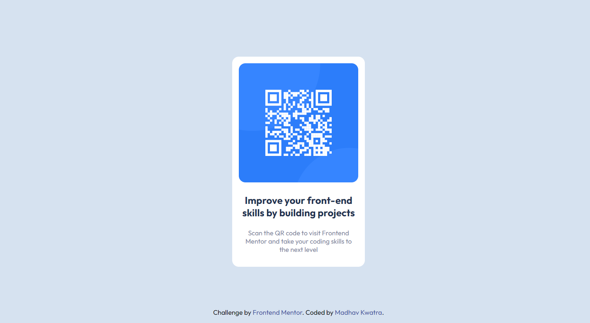

# Frontend Mentor - QR code component solution

This is a solution to the [QR code component challenge on Frontend Mentor](https://www.frontendmentor.io/challenges/qr-code-component-iux_sIO_H). Frontend Mentor challenges help you improve your coding skills by building realistic projects.

## Table of contents

- [Overview](#overview)
  - [Screenshot](#screenshot)
  - [Links](#links)
  - [Built with](#built-with)
- [Author](#author)

## Overview

Tried using frontendmentor.io for solving some front end challenges. It is my first challenge.I'll be solving more for improving my skills.

### Screenshot

### Links

- Solution URL: [https://github.com/MadhavKwatra/frontendmentor-challenge-qr-code-component-main](https://github.com/MadhavKwatra/frontendmentor-challenge-qr-code-component-main)

### Built with

- HTML
- [SCSS](https://sass-lang.com/) - For styles

## Author

<!-- - Website - [Madhav Kwatra](https://www.your-site.com) -->

- Frontend Mentor - [@MadhavKwatra](https://www.frontendmentor.io/profile/MadhavKwatra)
- Twitter - [@madhav_kwatra](https://www.twitter.com/madhav_kwatra)
